# FitApp - Aleksander Opałka - s24399

Prosta aplikacja Android napisana w języku Java, która umożliwia obliczenie wskaźnika BMI (Body Mass Index). 
Wyliczanie zapotrzebowania kalorycznego na podstawie ilości aktywności fizyczne
Sugerowanie przepisów na dania na podstawie zapotrzebowania kalorycznego

## Opis

Aplikacja pozwala użytkownikowi wprowadzić wagę (w kg) oraz wzrost (w m) i na tej podstawie oblicza BMI przy użyciu wzoru:

### Zjazd 1 - Zdjęcia z uruchomienia:

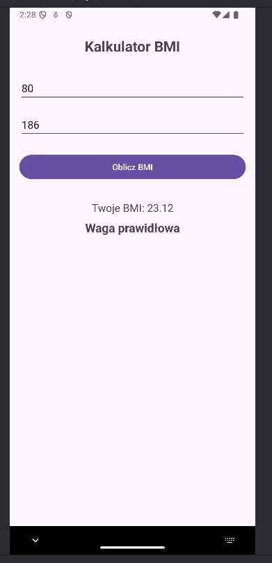

### Zjazd 2 - Zdjęcia z uruchomienia:

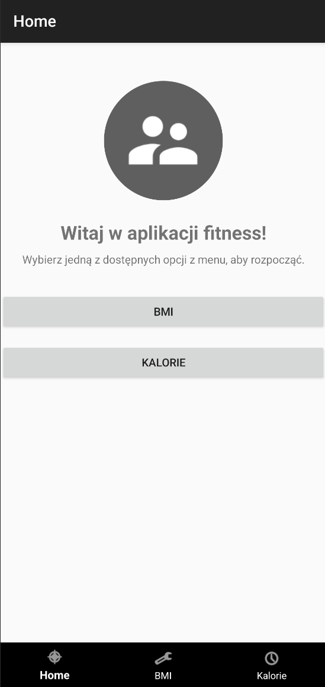
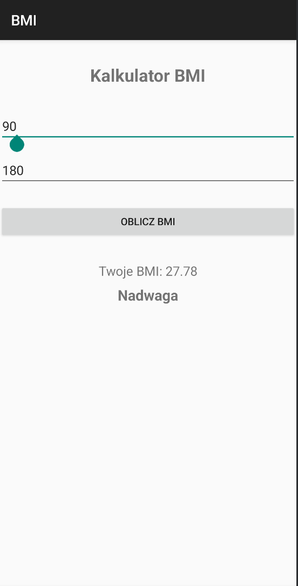
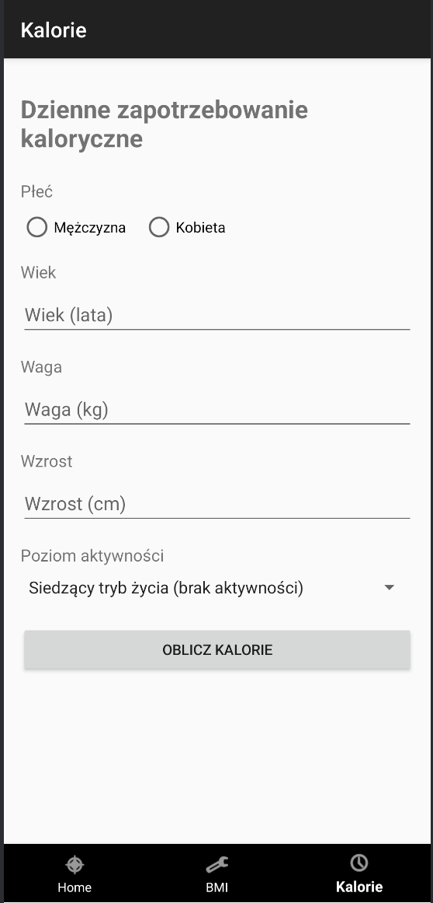
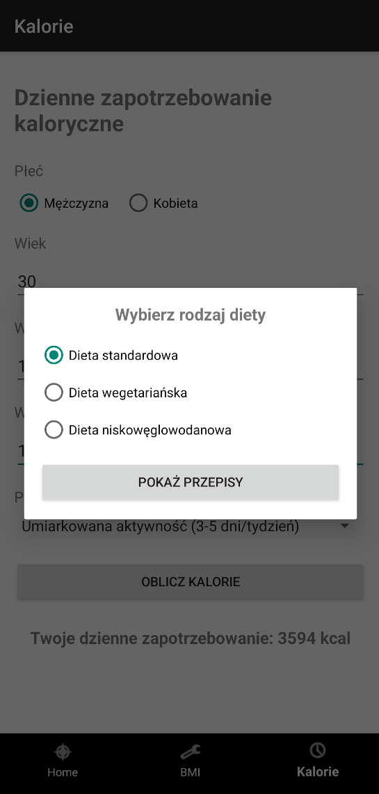
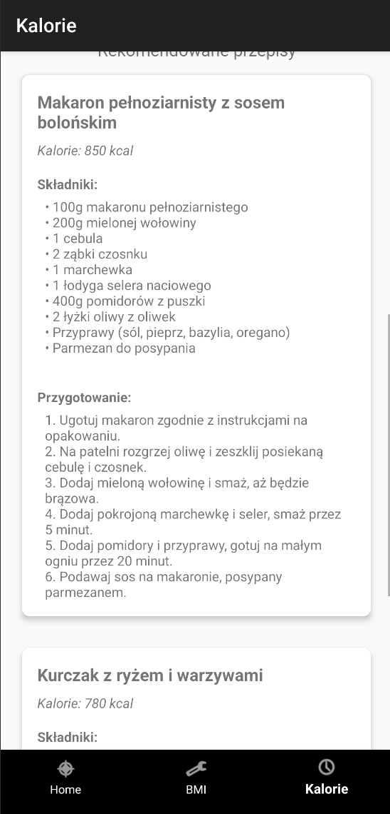
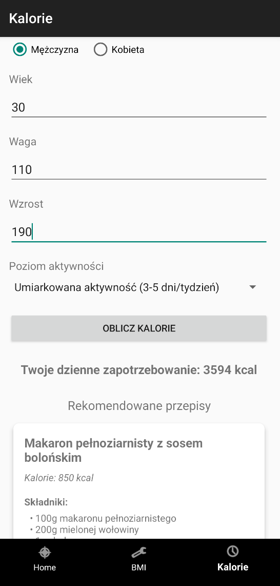

### Zjazd 3 - dodanie wyników statycznej analizy
Rezultaty w formie html można znaleść w katalogu staticAnalysis -> before & after

StaticAnalysis/before
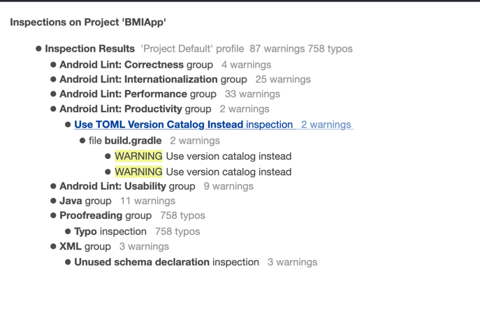

StaticAnalysis/after
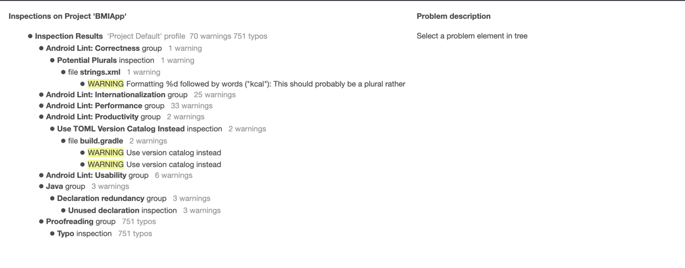

#### Junit screenshot:

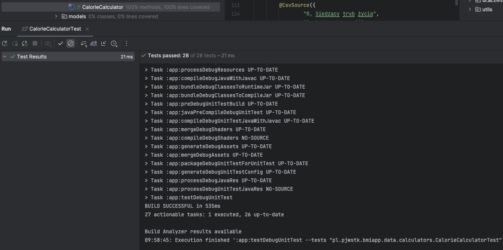

#### Espresso screenshot:

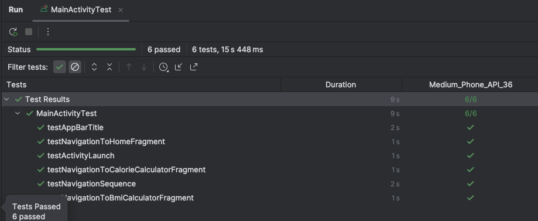

#### Monkey screenshot:

pełny log można znalesc w monkeyresult.log

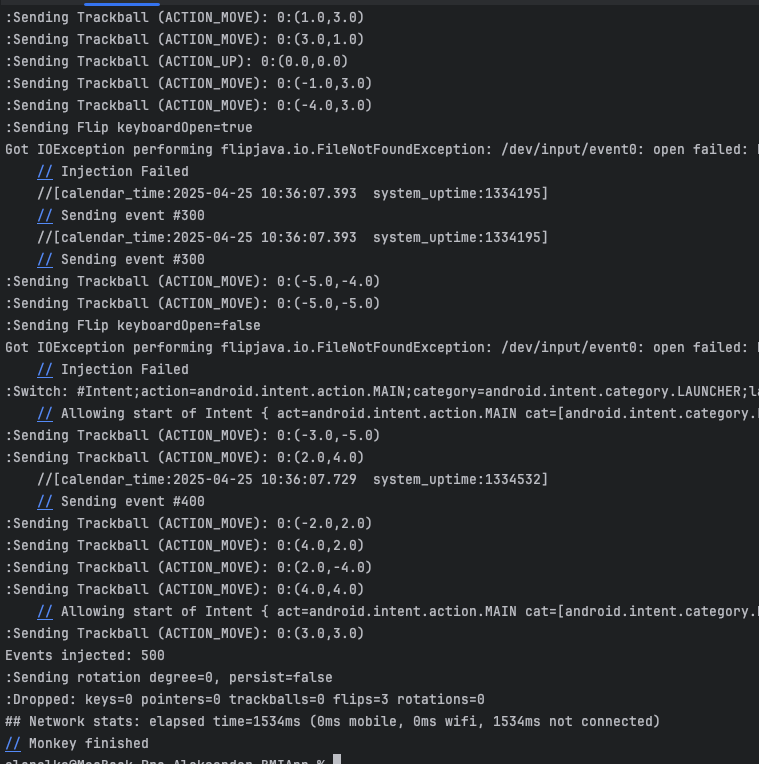